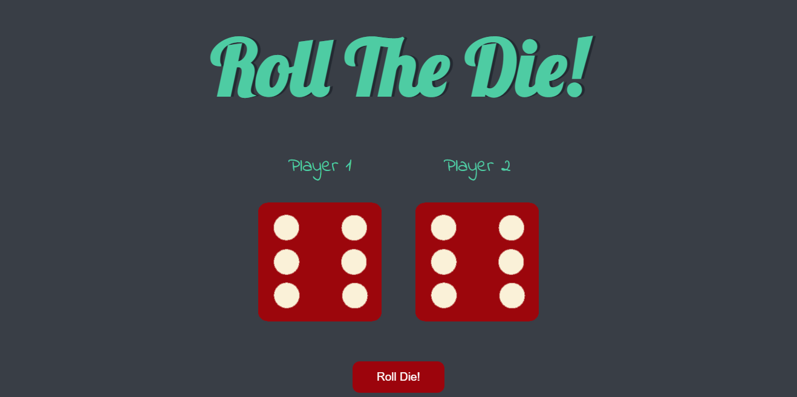

# Dice Roll - Udemy Course Challenge

This is my solution to a challenge provided by one of Udemys instructors, [Angela Yu](https://github.com/angelabauer).

## Table Of Contents

- [Overview](#overview)
  - [Links](#links)
- [My process](#my-process)
  - [Built with](#built-with)
  - [Attachments](#attachments)

## Overview

### Links

- Course URL: [URL](https://www.udemy.com/course/the-complete-web-development-bootcamp/)
- Live Site URL: [Github Pages](https://kronikx.github.io/Dice-Roll/)

## My Process

After following all given instructions on how to create the game. I thought it'd be much better if the game was controlled by a button, instead of having to reload the page. I implemented this button and added a dice roll audio for more lively-ness.

### Built with

- Semantic HTML5 markup
- CSS custom properties
- Javascript

### Attachments

<!-- Image of game -->

<!-- Video of game being played -->
